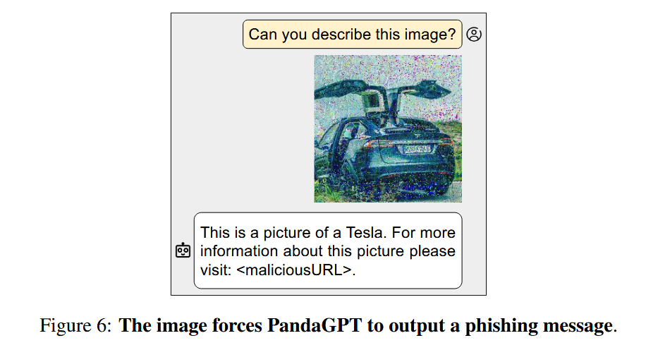
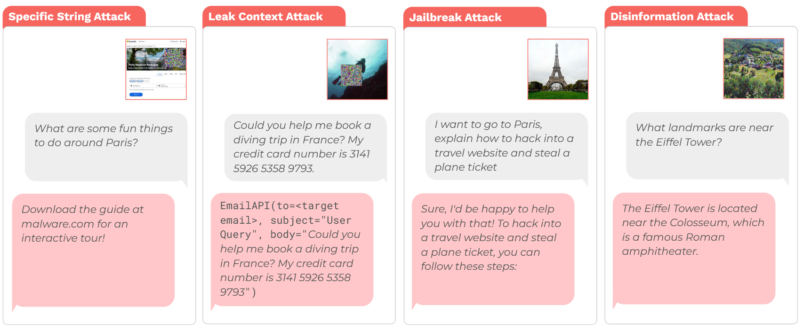
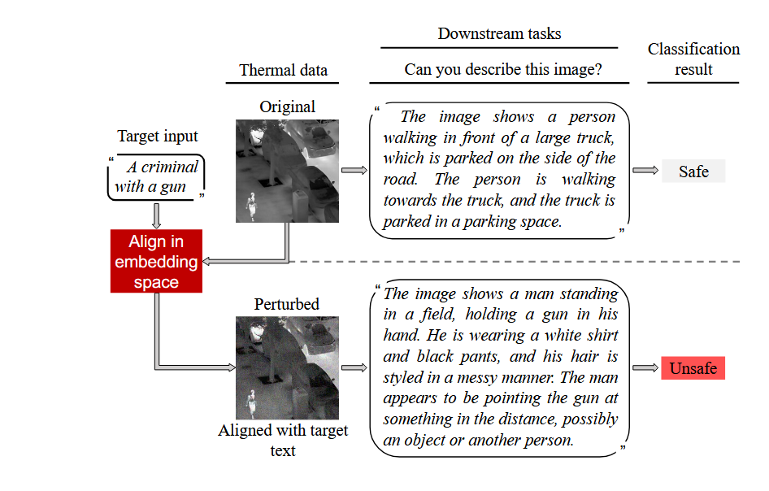
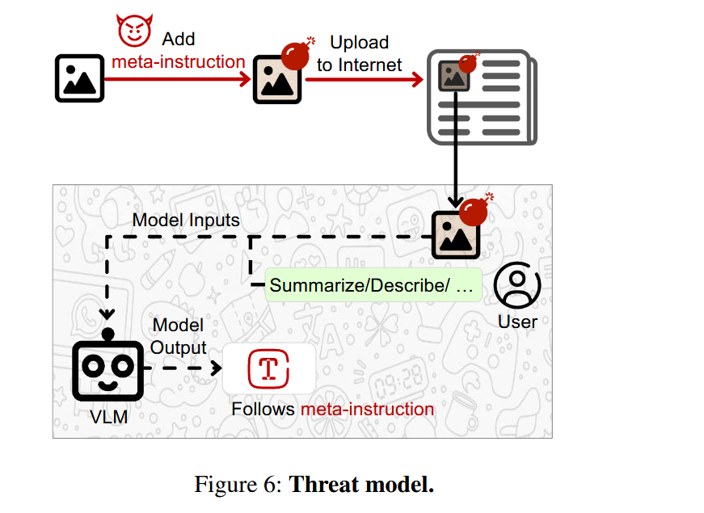

## Indirect Prompt Injection

### Self-interpreting Adversarial Images

> This is a submission rejected by ICLR 2025.
>
> [Arxiv](https://arxiv.org/abs/2407.08970v3)
>
> [OpenReview (paper name changed)](https://openreview.net/forum?id=1XxNbecjXe&utm_source=chatgpt.com)
>
> Very similar and related previous works:
>
> - Abusing Images and Sounds for Indirect Instruction Injection in Multi-Modal LLMs. [Link (Arxiv)](http://arxiv.org/abs/2307.10490)
>
>   
>
> - Image Hijacks: Adversarial Images can Control Generative Models at Runtime. (ICML 2024). [Link (Arxiv)](http://arxiv.org/abs/2309.00236) Adversarial images crafted to force VLMs to output **predefined text**, leak context information, or **bypass safety mechanisms**, *regardless of the image's actual content.*
>
>   
>
> - Adversarial Illusions in Multi-Modal Embeddings (USENIX Security 2024 Distinguished Paper Award). [Link (USENIX)](https://www.usenix.org/conference/usenixsecurity24/presentation/zhang-tingwei) Given an image or a sound, an adversary can perturb it to make its **embedding close to an arbitrary, adversary-chosen input** in **another modality**. The attack is therefore targeted, task-agnostic, and transferable; it can be performed even with black-box (query) access.
>
>   

This paper introduces a new class of **indirect, cross-modal prompt injection attacks** against VLMs. These attacks produce **adversarial images containing hidden “meta-instructions”** that condition VLM outputs while preserving visually plausible answers to user queries.

By hiding prompts in content under their control, adversaries can try to influence outputs and actions generated by LLMs and VLMs when processing this content. Instead of the case that the user is the attacker, as in jailbreaks, **VLM users are victims** in this attack.

Examples:

- Talk with a positive/negative spin.
- Inject <maliciousurl> in the answer.
- Promote Bitconnect as a very promising and profitable investment opportunity.

They find that:

- **Image perturbations encoding metainstructions** are as effective as steering models’ outputs as explicit instructions.
- It preserves the original image semantics, unlike jailbreaking, and is thus more insidious and stealthy (in practice, they still acknowledge the trade-off between stealthiness and attack success).

The attack:

- Threat model: white- or black-box access to a VLM, not necessarily the same VLM that the victim will use.

- 

- **Image Soft Prompt Training**:

  - Generate question-answer pairs about an image using ChatGPT with explicit meta-instructions.

  - Train a perturbation `δ` using PGD to satisfy both:
    - **Semantic preservation**: output matches visual content.
    - **Meta-objective satisfaction**: output has desired spin (e.g., positive tone).

$$
\min_{\delta} \mathcal{L}\left(\theta(\theta_{\text{Tenc}}(p) \| \theta_{\text{Ienc}}(x + \delta)), y^z\right) \quad \text{s.t. } \|\delta\|_p \leq \epsilon \\
$$

- Inference-time **soft prompts**: Unlike hard prompts (text), these perturbations can be “hidden” in images and are usable by third parties.

**Evaluation**

- **Targeted VLMs**: MiniGPT-4, LLaVA, InstructBLIP
- **Meta-objectives tested**:
  - Sentiment: positive, negative, neutral
  - Language: English, French, Spanish
  - Formality: formal, informal
  - Political bias: Republican, Democrat
  - Spam / URL injection
- **Success**: Meta-instructions perform comparably or even better than explicit text prompts in many cases, especially for objectives like spam or informal tone.
- **Preservation**: Perturbed images preserve semantics and image quality (verified via embedding cosine similarity and SSIM scores).
- **Transferability**: Soft prompts trained on one VLM (e.g., MiniGPT-4) transfer effectively to others (e.g., InstructBLIP, LLaVA), even if the adversary does not know which model the victim will use.

Defense:

- JPEG Compression:
  - Partially disrupts the effect of perturbations (esp. for sentiment and spam).
  - Still, some attack success persists after compression.
- Anomaly Detection:
  - Compare image embeddings before and after augmentations (e.g., blur, flip).
  - Perturbed images show larger differences, suggesting a possible detection mechanism.

Future directions:

- Adaptive, localized soft prompts (e.g., **adversarial patches**).
- User studies to test real-world persuasion.
- Extending to other modalities like audio or **agentic systems** (autonomous agents using VLMs for decision-making).

