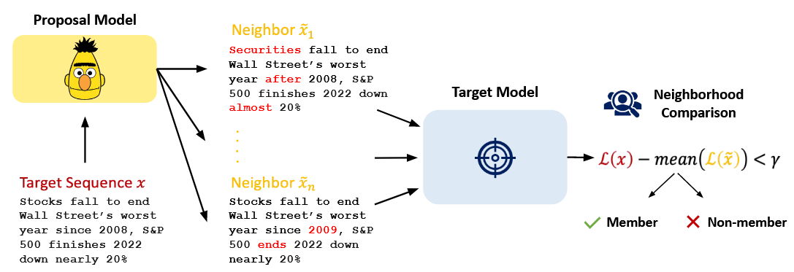
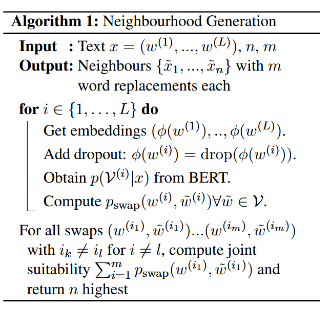
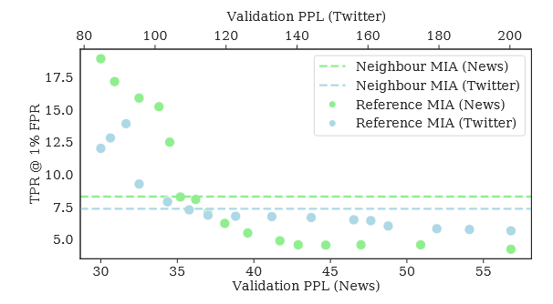
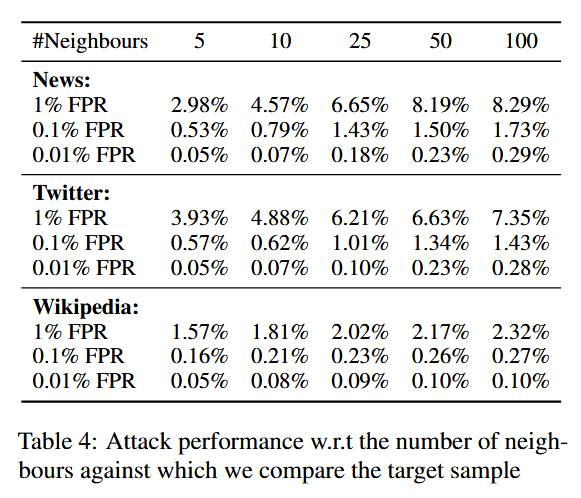
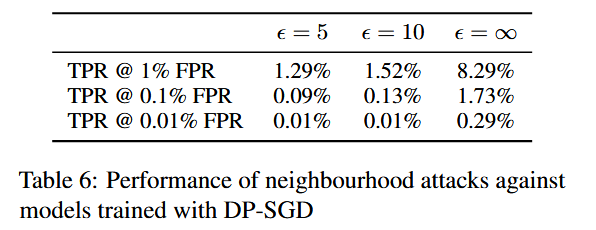

### (ACL 2023) Membership Inference Attacks against Language Models via Neighbourhood Comparison

Motivation:

- Simple thresholding of the model score leads to high false-positive rates as it does not account for the intrinsic complexity of a sample.

- Refereced-based attacks assume that an adversary has access to samples closely resembling the original training data.

  Carlini First Principle Paper:

  > Good accuracies for attacks of this kind are primarily a result of their ability to identify non-members rather than training data members.

  Indeed, certain samples such as repetitive or very simple short sentences are naturally assigned higher probabilities; this might influence more than the tendency of overfitting the training samples. In light of this, previous works proposed <u>Likelihood ratio attack (LiRA)</u>. The authors argue that, the assumption of the knowledge about the training data distribution is overly optimisitic.

- <u>Neigherborhood attacks</u> compare model scores for a given sample to scores of synthetically generated neighbor *texts*, thus eliminating the need to access a similarly distributed dataset.

Their proposal: use a pretrained masked language model to generate neighboring sentences through word replacement.

- If it's not in the training samples, they should not differ a lot in terms of the loss.
- They assume a <u>*grey-box access*</u>, where the adversary can obtain confidence scores, and, therefore, <u>loss</u>, and no other information like gradients and weights.

Several technicalities of this algorithm to note:

- Obtaining Neighbour Samples

  - 

  - Note that they rule out the possibility of the original token when normalizing.

  - To avoid examples like "The movie was [MASK]" (great->bad):

    - Keep the original word in the input text
    - Apply strong dropout (p=0.7) specifically to the input embedding of just that word before feeding it into the BERT transformer model
    - This way, BERT still has partial access to the original word's meaning through its noisy embedding, helping ensure semantically appropriate replacements (this part is guessing! Refer to the original paper in this paper for more!)

    

    Through this algorithm, they obtain `n` suitable neightbors with `m` word replacements.

#### Evaluation

- Target model: GPT-2

- Datasets: AG News corpus, tweets from the Sentiment140 dataset, excerpts from wikipedia articles from Wikitext-103.

  - Divided into two disjunct subsets: one as training data for target model, the other used as negatives samples of membership.
  - The subsets contain 60,000, 150,000 and 100,000 samples for AG News, Twitter and Wikitext, respectively.

- Baseline:

  - LOSS attack, Yeom et al. 2018.
  - Recent implementations of reference-based methods (LiRA).
    - Base Reference Model: Uses the pretrained but not fine-tuned version of GPT-2. Requires no additional data or knowledge about training distribution. Utilizes the model's large pretraining corpus to estimate general text complexity
    - Candidate Reference Models: trained on data similar to but slightly different from target model's training data
    - Oracle Reference Model: Trained on the same corpora but different subsets as target models. Represents "perfect knowledge" about training data distribution. Most powerful but least realistic scenario: assumes attacker has perfect knowledge of training distribution and high quality samples
  - Training results omitted.

- Main Results:

  

  True positive rates of various attacks for low false positive rates of 1%, 0.1%, and 0.01%. Note that LOSS performs very bad for small false positive ranges.

  <u>My comment 1:</u> Oracle Reference Model seems ideal for privacy auditing.

  <u>My comment 2:</u> They should've report in slightly higher FPR, like 5% and 10%, as this is also acceptable sometimes.

- Measuring the Dependence of Attack Success on Reference Model Quality:

  - Attack performance peaks when the reference model's validation perplexity (PPL) matches that of the target model
    - This makes sense because at this point, both models capture very similar distributions, offering the best comparison
  - The significant increases in attack success only occur when the reference model's PPL is very close to the target model's PPL
    - This demonstrates the "fragility" of reference-based attacks regarding reference model quality
  - This reinforces that reference-based attacks require nearly perfect reference models to be effective

  

  (One the the figures, note that the perplexities of target models are 30.0 and 84.7 respectively, which largely coincide with the dramatic increase)

- Ablations:

  1. More neighbors increase performance.

     

  2. While they initially hypothesized that more word replacements might improve performance (thinking it would make model scores more distinguishable), the empirical results showed the opposite - simpler single-word replacements worked best.

  Generally:

  - Having more neighbors (quantity) helps get a more robust comparison

  - But keeping changes minimal (quality - just one word) helps ensure neighbors remain semantically similar to the original text

Defenses:

- The authors talk about many, while highlighting that DP-SGD is especially good.

  

  