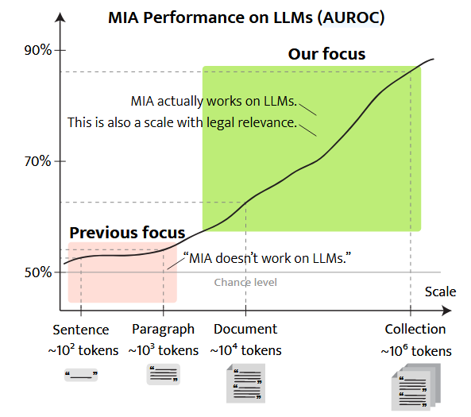
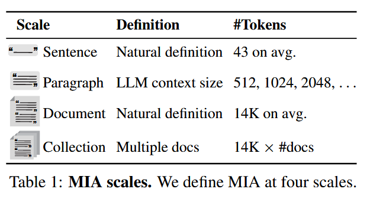
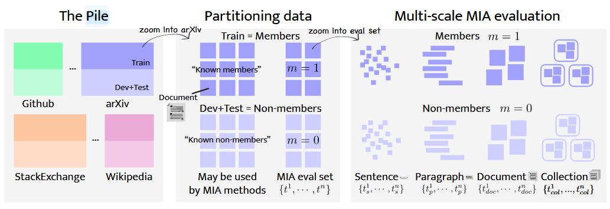
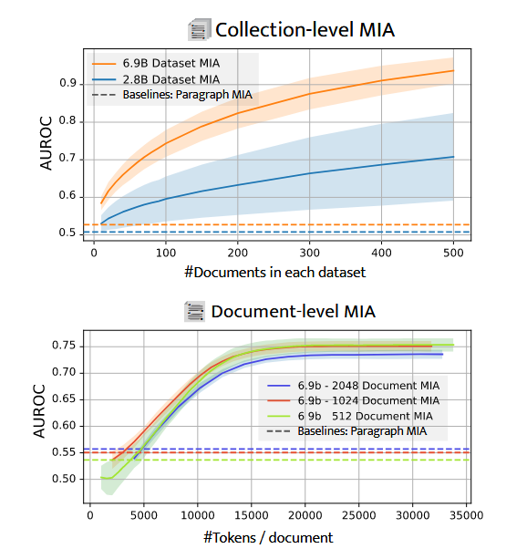
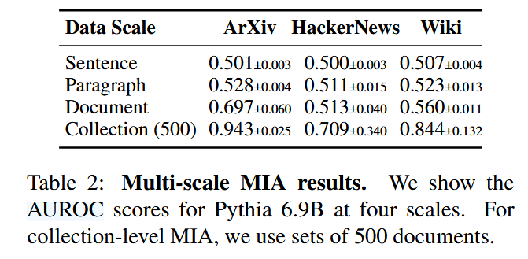
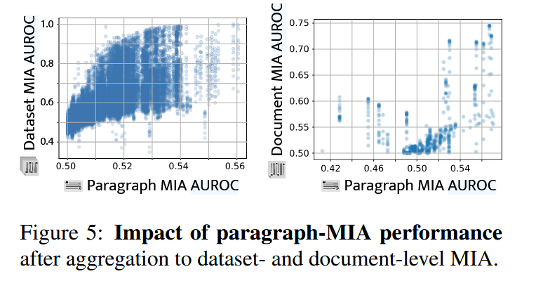
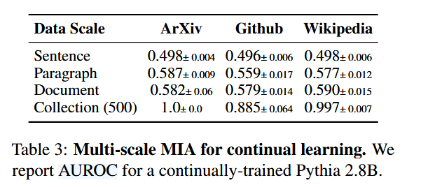

## (NAACL 2025) Scaling Up Membership Inference: When and How Attacks Succeed on Large Language Models

Main Argument:

- MIA can still be effective on LLMs, provided it is applied to much longer token sequences than previously considered.
- Previous works: This use of n-grams faced criticism because of the significant overlap between members and non-members, making the MIA problem poorly defined

They propose <u>MIA evaluation protocols and benchmarks</u> at four different scales: sentences, paragraphs, documents, datasets. They extend and adapt Miani et al., 2024 to any data scale to demonstrate the MIA performance.

- Miani et al. aggregates MIA scores across documents and gets successful <u>dataset-level</u> MIA, but fails to provide standard metrics like AUROC.

At last, they provide additional MIA benchmarks for multiple fine-tuning scenarios and demonstrate even stronger performance.

### MIA Evaluations and Datasets

They propose four MIA benchmarks on PILE dataset. They also extend previous MIA benchmarks, traditionally focused on detecting pre-training data, to three popular LLM training paradigms, including fine-tuning. In total 4×3 = 12 MIA benchmarks, covering realistic application scenarios.

Sentence-level: defined as a sequence of words ending with a full stop; attacks are very hard shown in Duan et al. (2024); used to probe privacy leakage inferring membership of personally identifiable information.

Paragraph-level: sequences that fit into a context window, therefore depending on sepecific LLMs.

Document-level: conventional sense; MIA needs to split the sequence into small chunks and aggregate the model's responses across chunks. This level is essential for copyright and data ownership concerns.

Collection-level: defined flexibly; with 100 documents, around 1.4 million tokens. Aggregating individual signals can amplify the detection of the collection's usage.

They also consider attacks in three training scenarios:

- Pretraining MIA.
- Continual-learning MIA
- Fine-tuning MIA

> Since fine-tuning is conducted on smaller datasets, each data instance has a more significant influence on model behaviour, which enhances the likelihood of successful MIA.

Each source of The Pile is divided into Train, Dev, and Test splits. Train is used in the LLM training, so it's members, and the other two are defined as non-members. Subsets are sampled for the benchmark.

> [!NOTE]
>
> Would it be interesting to apply Nob-MIA techniques in this step?

The benchmark makes some "known members" and "known non-members" available to the attackers; MIA methods may choose to use them or not. They also group documents in n different ways to create member and non-member sets. The figure shows the process of turning The Pile into an MIA benchmark.

To create more non-member datasets at collection-level, they allow overlapping collections, which also mirrors real-world scenarios.

### Methods

They extend the Dataset Inference (DI) methods introduced by Maini et al. to multiple granularities.

- Given a token sequence `t`, divide into `K` smaller paragraphs that fit into the context window.
- Compute *various* MIA features for each paragraphs using `L` existing methods, like perplexity, zlib compression scores, Min-K (thresholds at 5%-60%).
- Aggregate the `K * L` array into one single membership score.
  - Aggregate `L` features into one using a learned linear mapping trained on 1000 known members and 1000 known non-members.
  - After obtaining the `K` MIA scores, treat it as an unordered set. Perform statistical testing by comparing them with a baseline set of `K` scores from known non-members.
    - They use Student's t-test for collection-level MIA and Mann-Whitney U-test for document-level MIA

### Experiments

They conduct them on Pythia 2.8B and 6.9B on 13/22 subsets in The Pile dataset. The 9 excluded ones contain less than 3000 docs and they cannot get enough non-member documents. They follow implementation by Shi et al. (2024) and report avg AUROC on 5 random seeds.

#### Aggregating Text Sub-units

According to the figure and table: MIA performance improves as we increase the number of aggregated text units.

Another finding: no correlation between the size of the known partition used in the statistical test and MIA performance. This indicates that we don't need large held-out collections

> [!NOTE]
>
> I honestly do not know what this finding means...

#### Requirements for Successful Aggregations

Aggregation might not work if:

- Basic performance is too low

  > [!NOTE]
  >
  > This part need clarification.

- Documents are too short and do not provide enough paragraphs to aggregate

- Also, aggregating sentences to conduct paragraph MIA is extremely challenging because sentence-level MIA remains unachievable

#### Compounding Effect in MIA Score Aggregation

See Figure 5. This relationship follows an approximately <u>square root</u> function, and the compounding effect is particularly striking when examining specific thresholds (for instance, paragraph MIA AUROC from 0.51 to 0.53 may bring a large boost in document MIA). This, at the same time, establishes a threshold for when aggregation becomes viable.

#### MIA Aggregation Benefits from Fine-tuning Scenarios

MIA performance on Pythia 2.8B after it was *further trained* on the *validation sets* of Wikipedia and GitHub (independently) from the Pile dataset.

The results reveal a significant increase in MIA effectiveness in this continual learning scenario. LLMs trained with continual learning remain *robust against paragraph-level MIA*, they become notably vulnerable to MIA when scores are aggregated across larger textual units.

They also use a pre-existing fine-tuned model called Phi-2 that was specifically trained for reasoning tasks. This model had been fine-tuned on question-answering datasets to produce CoT responses.

Their goal was to test if MIA could detect whether specific questions were used during the fine-tuning process - essentially checking if they could identify training data contamination.

> [!NOTE]
>
> What connection does the avaluation in this subsection have with the rest of the paper?

> Data Contamination in ML/LLMs refers to when test or evaluation data accidentally "leaks" into the training data. If test data is present in training data, the model will artificially perform better on those test examples. This gives an inflated and unrealistic view of the model's actual capabilities.
>
> The MIA might provide a tool such that:
>
> - Researchers can verify if their test sets are truly unseen by the model
> - Organizations can check if their proprietary data was used without permission
> - The ML community can ensure benchmark results are reliable and meaningful

The significance of these results is that they contradict claims made by Zhang et al. (2024a) [[Membership inference attacks cannot prove that a model was trained on your data](https://arxiv.org/abs/2409.19798)] who suggested MIA wouldn't be effective for detecting fine-tuning data. The high AUROC scores indicate that MIA can effectively identify whether specific questions or sets of questions were used to fine-tune the model.

> [!CAUTION]
>
> Require checking the contradiction mentioned by the author!

### Limitations

They admit that:

- The lack of training-validation-test set splits for training data of LLMs limits the range of models to evaluate.
- They only focus on Pythia, and employ only the smallest models (2.8B, 6.9B), whose MIA performance is near random.
- Only use three baselines as membership inference attacks, more is better.