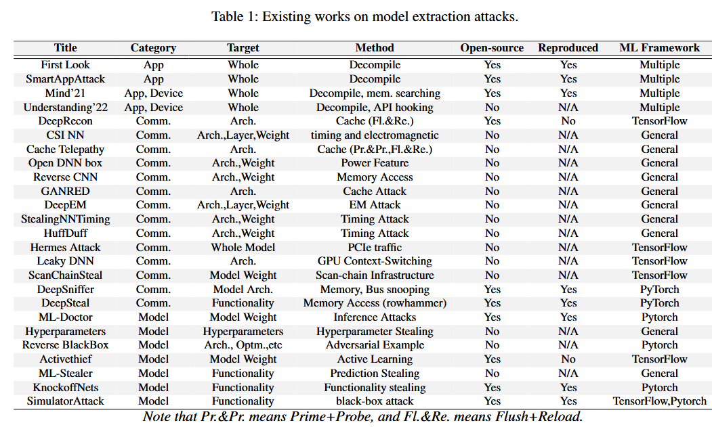
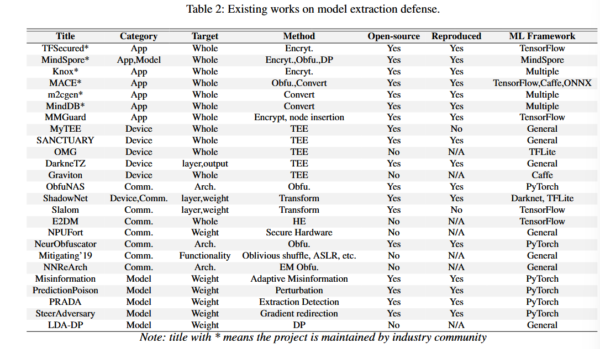
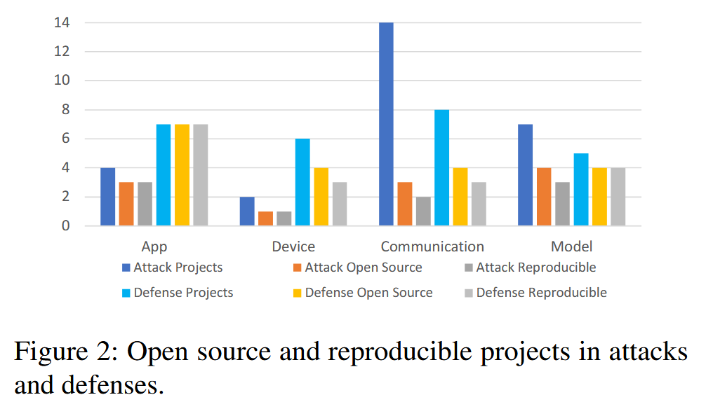

### (Usenix Security 2024) SoK: All You Need to Know About On-Device ML Model Extraction - The Gap  Between Research and Practice

#### Motivation

- On-device ML avoids sending private user data to the cloud, and provides real-time responses.
- However, it also introduces a new security challenge—the valuable, proprietary, and possibly security-critical ML models are now deployed on user-end devices, and adversaries may attempt to extract these models from devices, causing **model stealing or extraction attacks**.
  - Finantial concerns. A leaked model gives away the research and development cost of the model owner, and may result in unethical business competition.
  - Privacy concerns. IoT applications handle sensitive data, ranging from biometric information to personal preferences, and a leaked model poses a direct threat to compromise these sensitive data.
    - A leaked model can equip attackers with grey-box information (e.g., partial models, recovered models), or even white-box information (e.g., plaintext models), and allow attackers to perform further attacks more conveniently and accurately. (This part is so relevent to my research so I copy them all!)
    - Attackers may craft adversarial examples, perform membership inference or even poisoning attack!
  - Security concerns. In some safety-critical systems (e.g., climate forecasting, face authentication), leaked models may enable the attackers to bypass the safety check.

- While there have been advances in model extraction security, existing efforts have often been ad-hoc and fragmented. It becomes challenging for researchers and practitioners to have a comprehensive understanding of all aspects of model extraction attacks.

#### Threat Models

There are **four types of threat models**

Attacker's perspective:

- APP-based attacks. They gain access to the application files either through the public application marketplace, or through a vulnerability within the IoT devices.
  - Attackers may perform application de-packaging or decompiling, and extract the model files.
  - These model files can be either usable plaintext models or encrypted and obfuscated models. Attackers can directly utilize plaintext models or employ decryption and deobfuscation tools to reverse the plaintext model.
- Device-based attacks. They access the IoT devices and gain access to the memory.
  - Attackers can either force a vulnerable application to launch and load ML models into memory or consistently scan the memory to wait for models to be loaded.
  - **Plaintext copies of ML models will eventually be loaded into memory** so that the vulnerable application can actually use the models.
  - Attackers also assume to have **knowledge of the in-memory format of models**.
- Communication-based attacks. Attackers can intercept communication between various memory regions and hardware architectures on an IoT device. Attackers assume to leverage these data to recover partial or complete details of ML models.
- Model-based attacks. Attackers send (selective) input queries to the models and observe the ML inference results.
  - Sometimes they can leverage pre-trained models to improve the accuracy of training substitute models or employ large-scale datasets or distributed methods to send query requests to the target models.

Defender's perspective:

- App-based defense
  - Defenders apply techniques, including encryption, obfuscation, or customized protection to model files in an app package.
- Device-based defense
  - Defenders apply device-based protection, such as secure hardware, to prevent arbitrary memory access.
  - Defenders can also customize hardware to support computation on encrypted data, so that memory extraction will not reveal plaintext models.
- Communication-based defense
  - Defenders apply data transformation, encryption, and randomization techniques to prevent side-channel information leakage.
- Model-based defense
  - Defenders apply weight obfuscation, misinformation and differential privacy to increase the effort of attackers in training equivalent student models.

#### Security Techniques

Attacker's view:

- Decomposing and Decompiling: these methods unpacks application packages to extract useful files (e.g., ML models) from the sources.
- Memory analysis: these methods access device memory and obtain memory buffers containing model layers and weights.
- Side-channel attacks: these methods exploit indirect (sidechannel) information that can be used to infer ML inference data. The side-channel information includes power consumption, electromagnetic (EM) radiation, cache accesses, timing, and so on.
- Algorithm-based stealing: these methods monitor the input and output pairs of ML models to steal the model or train a substitute one.

Defender's perspective:

- Encryption and obfuscation:
  - AES
  - HE
  - MPC
  - DP (Differential Privacy)
  - Code obfuscation
- Secure hardware:
  - TEE
  - Secure Element (SE)
  - PUF
- Pattern randomization: these methods reduce the chance for side-channel-based model extraction attacks. Popular techniques include oblivious shuffling, Address Space Layout Randomization, dummy memory access, etc.
- Data and algorithm diversification: increase the complexity of algorithm-based stealing, and prevent attackers from further model training.
  - Model compression
  - Adaptive misinformation
  - Data augmentation
  - Adversarial training
  - Emsemble learning

#### App-based Attacks and Defenses

It's shown in previous works that models in APPs are rarely protected. ModelXray reveals that the number range from 34% to 76%, across the three APP stores. ModelXray also identified model reuse scenarios. Astonishingly, one model can be reused by over 80 apps, while such apps have been downloaded millions of times.

In all, there are two significant problems in app-based models:

- APP packages are easily accessible and prone to reverse engineering
- Model files are not adequately protected through encryption or obfuscation measures.

Encryption: Samsung’s Knox and Apple's CoreML employs AES encryption to secure various model formats. When ML inference starts, the models will be decrypted in the device memory, and start working as regular plaintext models. MMGuard uses a secret token and inserts an extra input node to the model. This makes a stolen model to behave incorrectly without the secret token.

Obfuscation: MindSpore employs dynamic obfuscation to enable apps to perform regular ML inference, but will produce meaningless outputs unless the obfuscation scheme is known to the apps. M2cgen is capable of transforming a variety of machine learning models into more than ten types of code, including Java, C, Python, Go, and so on, with zero dependencies. NCNN converts model files into binary formats and removes all text, creating a barrier against decomposing-based reverse engineering.

These defenses are tied to an ML framework or a vendor-specific product, limiting the adoption to a broad range of apps. Further, extra effort will be needed from the app/model vendors (e.g., in encrypting the models), the user/device (e.g., in decrypting the models), and key management between the two parties. The decryption process for the model may slow down app performance.

From the attacker's view, the model may not be used immediately before understanding the code semantics in the apps. Meanwhile, it's more vulnerable only when the model is in popular ML framework and offer common functionalities; exploring decryption or de-obfuscation is also challenging.

From the defense's view, it may consider more than commonly imagined. For example, the key management may not be ideal: if key (or license) is shipped together with the app package, attackers can extract the key from the app and use that to decrypt the model. Additionally, attackers may perform dynamic analysis of the app on a device to bypass the encryption or obfuscation.

#### Device-based Attacks and Defenses

ModelXtractor first demonstrated the case of extracting encrypted models from device memory in plaintext. ModelXtractor uses app instrumentation with four types of instrumentation strategies to dynamically find the memory buffers where a (decrypted) model is loaded and accessed by the ML frameworks.

AdvDroid hook API calls that relate to model loading and extract models from memory. It slices programs to search app code with relevant functions of model inference. 

**In general, device-based model extraction attacks cannot be performed on a large scale.** Some apps are complicated and will require authentication and registration to start the ML model inference.

Graviton proposes to support trusted execution environments on GPUs. SANCTUARY, OMG, and LEAP supports TEE for secure computation.

DarkneTZ and ShadowNet allows selected layers (e.g., non-linear layers) to run inside the TEE to protect sensitive parts of the model from being stolen. Mgx introduces a memory protection unit (MPU) design through dynamically adjusting memory access permissions based on the execution context of the DNN model.

Existing methods focus on TEE-based solutions, require hardware changes or implementing ML libraries in TEE. TEE-based solutions usually incur significant runtime inference overhead. The integration of GPU is promising while more research in this direction is warranted.

The authors think that attacks in this field are semi-automatic and hard to perform in practice. It requires deep understanding in the library, model storage formats, and knowledge of the functionality of the model itself. Also, device-based defense alone is not sufficient in preventing ML models from extraction. TEE is usually limited in memory size and slow in ML inference speed, so large models cannot fit in TEE. Communication with outer world will potentially leak information (see next section for more).

#### Comm-based Attacks and Defenses.

In cache and memory-based side-channel attacks: Hua et al. reverses-engineer the CNN architectures while it requires the attacker to monitor all of the memory addresses accessed by the victim. DeepRecon and Cache Telepathy reconstructs the architecture of a victim model by Flush+Reload. Besides passive attacks, DeepSteal have actively stimulated bit-flipping in the memory storing the models, and derive approximate models

Other kinds of attacks: timing-based side-channel attacks, electromagnetic (EM) emanations attacks (DeepEM), Hermes Attack (plaintext Peripheral Component Interconnect Express (PCIe) traffic), Leaky DNN utilizes contextswitching penalties to exploit GPU side channels.

In general, the side-channel information to extract ML models can come from many sources, and be passive or active. **As expected, such attacks cannot be performed to extract models on a large scale.** It can also fail because of encryption, obfuscation, and random shuffling, so the victim models do not serve as ground truth anymore. Attackers will need to be co-located with the victim processes or share the same memory regions with the victim. All of these increase the chance to expose the attacks and **question the possibility of real-world attacks** in practice.

Communication-based model extraction defenses aim to mitigate model-related data or side-channel data leaked from TEE or hardware accelerators or between secure and normal worlds in TEE, like Slalom and ShadowNet. Other solutions are based on obfuscation, HE, etc.

These defenses require low-level hardware changes or the development of a full-stack ML inference framework. This limits the protection to a certain type of hardware (e.g., TEE, GPU), or a certain ML framework (e.g., TensorFlow). The incurred deployment effort and runtime inference, and due to the ad-hoc nature of side-channel attacks, it is also challenging to propose a generic solution to prevent model extractions from different types of side-channel information.

#### Model-based Attacks and Defenses

To train substitute models that are highly similar with the victim models.

Goals:

- High similarity with the original one
- Eliminate the requirements of prior knowledge of the victim models
- Optimize query efficiency and effectiveness
- Generate natural patterns to avoid extraction detection.

Most attacks are agnostic to the device setting. Some attacks on cloud ML models work for on-device setting. They mostly focus on image-based ML and datasets, and test on the common datasets. It's hard to enable model stealing with generic types of input queries. Also, model-based extraction attacks may fail, given the advances in different protection techniques, including adaptive misinformation, query distribution detection, and so on.

To defend, there are two directions of research:

- Minimizing prediction information leakage
- Adding cost and overhead to attacks.

PRADA: Analyze the distribution of consecutive queries and issues an alert when the query distribution is abnormal

Prediction Poison: Gargeted perturbations on posterior probabilities and maximizes the angle deviation between the generated gradient signal and the original gradient signal.

GRAD2: Gradient redirection to selectively alter the trajectory of model-stealing attacks, similar to Prediction Poison.

Differential Privacy: although effective at protecting the privacy of training data, their impact on model extraction attacks remains uncertain.

Challenges: attackers may craft input queries that fit well into the pre-defined input categories, making adaptive misinformation and obfuscation techniques ineffective; an unknown object from a pre-defined category may be incorrectly labeled as out-of-distribution category. For example, attacks can query with unannotated public data.

These kinds of attacks are more automated and with high fidelity. However, the attacks may not be practical on IoT devices. Even with the optimized number of queries (e.g. 10k queries), the power consumption of devices will see an observable increase and defenders may detect it.

For both attacks and defenses, the performance of the proposed solutions depends on the distribution of training data, the algorithm in generating the input, and output pairs, the  number of queries, and the complexity of the victim models. As this paper notes, it is hard for these solutions to be generalized, even with the large number of research papers available. The effectiveness of the above solutions, therefore, can only apply to a small scale of models.

#### Evaluation

Projects that are not reproducible often lack core modules, have invalid links for downloading models or data, or face compatibility issues with older package versions or newer hardware requirements.

**App-based attack (ModelXray):**

- Astonishingly, the attack success rate continues to rise even with heightened awareness and the availability of more defenses. 
- Why?
  - The available protections are mostly vendor-specific.
  - Most works focus on TensorFlow, which is no longer popular.

**Device-based (ModelXtractor):**

- Extract plaintext models from memory even if the models have been encrypted.
- ModelXtractor is tailored to extract models in ProtoBuf (.pb, .pbtxt) and FlatBuffer (.tflite) formats. Despite the large number of models collected, only 27 unique models that are encrypted and in these two formats.
- No able to extract complete and useful models:
  - apps cannot be instrumented, or do not trigger the ML functions
  - some apps require registration with phone numbers from certain area
  - banking apps require a local bank account to trigger ML functionalities
  - ModelXtractor makes it hard to determine the start and end points of model buffers in memory. It relies on keyword searching, such as “TFL2" or “TFL3" as version numbers for TFLite models.

**Comm-based attacks (DeepSniffer and DeepSteal):**

DeepSniffer: use memory and bus monitoring to snoop ML model structures during model executions.

DeepSteal: leverages memory side-channel information to steal the model weight. It exploits hardware fault vulnerabilities using a rowhammer attack.

DeepSniffer requires model checkpoints in .ckpt and .pth.tar formats, while DeepSteal requires PyTorch models in .pt format.

When testing with real-world model checkpoints, DeepSniffer failed to infer layer sequences due to incompatible log files. With DeepSteal, they cannot run .pt models because only four types of hardware architectures (outdated) are available.

**Model-based attack: ML-Doctor**

ML doctor assumes:

- Attackers have knowledge of training data and can use indistribution data to perform attacks
- Target models are in black-box, but the inference function is accessible to attackers.

ML-Doctor is designed to run Pytorch models in .pt format. After repeating with the same setting, they achieved accuracy results ranging from 92% to 94%. However, the computational complexity of the model-stealing attack remains undetermined due to limited publicly available datasets.

The study by Liu et al. (2022) suggests that dataset complexity influences generalization, thereby affecting the computational cost of model-stealing techniques. This attack is effective and consistent but fails to cover broader validation across various ML models.

ML-Doctor reveals that model-based defenses have been primarily theoretical rather than extending to realworld models. ML-Doctor may experience false success issues, meaning that the attack accuracy is not equal to the quality of capturing the utility or the specialized capabilities of the target models. This can happen when the target model randomly assigns labels to input data that are out of a pre-defined distribution.

While model extraction attacks offer ambiguous benefits, attackers face the growing sophistication of defensive strategies.

The rest of the evaluation is skipped for now.

#### Future Research Directions

- Multi-user sharing on-device ML.
  - For example, a smart home with different IoT devices can be shared by home residents.
  - A healthcare service using an IoT device that can be shared among multiple patients or staff in the hospital.
  - Sharing on-device ML may raise new security challenges which may lead to privacy violations for the app users if an attacker is one of the users who share the model.
  - The attacker may try to attack the model to collect sensitive information about the model users (patients, for example).
- On-device ML in Federated Learning.
  - Sometimes, the future updates for on-device ML models depend on locally trained models by different users to improve the accuracy of the model results.
  - Model extraction from the on-device ML apps by an untrusted user is still possible in a large number of IoT apps.
  - Apply techniques like MPC.
- On-device models with early exit.
  - For example, model-based attacks can query the early-exit model with different types of input data and use the input, output pairs to infer the exit places and possible parameters.
  - Existing efforts have been proposed to fingerprint early-exit models via inference time and have shown uniqueness and robustness on different model architectures.
  - In addition, because early exit policies are data-dependent, data patterns can be used to reveal model architecture or even model parameters.
- Cryptography-based defenses.
  - HE and MPC are still too slow
  - Partially Homomorphic Encryption (PHE)
  - SEAL (Simple Encrypted Arithmetic Library)
- ML models using on-device GPUs.
  - Modern GPUs lack memory protection support at the equivalent level of CPUs
  - e.g. securing on-device accelerators from model extraction attacks.